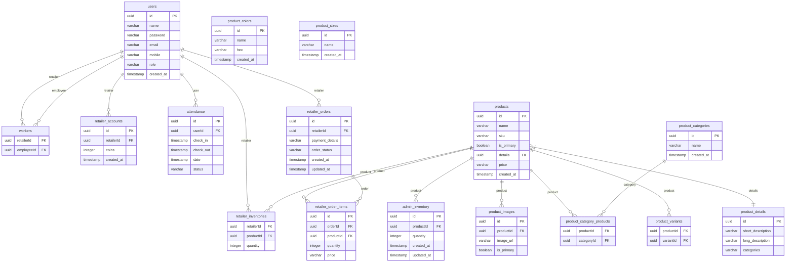
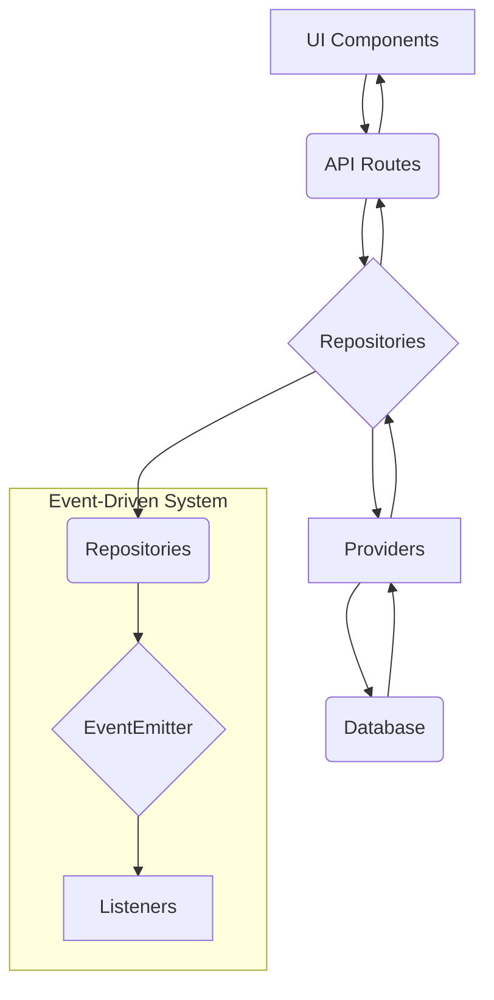

# Lalades Admin Panel

This document provides a comprehensive overview of the Lalades Admin Panel, including its architecture, data flow, and potential future enhancements.

## 1. Database Schema

The database schema is the foundation of the Lalades Admin Panel. It is designed to be robust and scalable, and it is defined using Drizzle ORM in `src/db/schema.ts`.

### 1.1. Detailed Database Diagram

```mermaid
graph TD
    subgraph "User Management"
        users(users) --> workers(workers)
        users --> retailer_accounts(retailer_accounts)
        users --> retailer_inventories(retailer_inventories)
        users --> retailer_orders(retailer_orders)
        users --> attendance(attendance)
    end

    subgraph "Product Management"
        products(products) --> product_details(product_details)
        products --> product_images(product_images)
        products --> product_category_products(product_category_products)
        products --> product_variants(product_variants)
        product_categories(product_categories) --> product_category_products
        product_colors(product_colors)
        product_sizes(product_sizes)
    end

    subgraph "Inventory Management"
        products --> admin_inventory(admin_inventory)
        products --> retailer_inventories
    end

    subgraph "Order Management"
        retailer_orders(retailer_orders) --> retailer_order_items(retailer_order_items)
        products --> retailer_order_items
    end

    style users fill:#f9f,stroke:#333,stroke-width:2px
    style workers fill:#ccf,stroke:#333,stroke-width:2px
    style retailer_accounts fill:#ccf,stroke:#333,stroke-width:2px
    style retailer_inventories fill:#ccf,stroke:#333,stroke-width:2px
    style admin_inventory fill:#ccf,stroke:#333,stroke-width:2px
    style attendance fill:#ccf,stroke:#333,stroke-width:2px
    style products fill:#f9f,stroke:#333,stroke-width:2px
    style product_details fill:#ccf,stroke:#333,stroke-width:2px
    style product_images fill:#ccf,stroke:#333,stroke-width:2px
    style product_categories fill:#f9f,stroke:#333,stroke-width:2px
    style product_category_products fill:#ccf,stroke:#333,stroke-width:2px
    style product_colors fill:#ccf,stroke:#333,stroke-width:2px
    style product_sizes fill:#ccf,stroke:#333,stroke-width:2px
    style product_variants fill:#ccf,stroke:#333,stroke-width:2px
    style retailer_orders fill:#f9f,stroke:#333,stroke-width:2px
    style retailer_order_items fill:#ccf,stroke:#333,stroke-width:2px
```

### 1.2. Database Diagram (ERD)

### 1.3. Table Explanations

- **`users`:** This is the central table for all users of the application, including administrators, employees, and retailers. The `role` column distinguishes between the different user types.
- **`workers`:** This table establishes a many-to-many relationship between retailers and employees. It allows a retailer to have multiple employees and an employee to work for multiple retailers.
- **`retailer_accounts`:** Each retailer has an account that stores their coin balance. This is used for transactions within the application.
- **`retailer_inventories`:** This table tracks the inventory of each product for each retailer.
- **`admin_inventory`:** This table tracks the central inventory of all products, managed by the administrator.
- **`attendance`:** This table records the check-in and check-out times of employees, which is used for payroll and monitoring.
- **`products`:** This table contains the core information for each product, such as its name, SKU, and price.
- **`product_details`:** This table stores additional, more descriptive information about each product.
- **`product_images`:** This table stores the URLs of the images for each product.
- **`product_categories`:** This table defines the different categories that a product can belong to.
- **`product_category_products`:** This table establishes a many-to-many relationship between products and categories.
- **`product_colors` and `product_sizes`:** These tables define the available colors and sizes for products.
- **`product_variants`:** This table manages the different variants of a product, such as different colors or sizes.
- **`retailer_orders`:** This table stores the orders placed by retailers.
- **`retailer_order_items`:** This table stores the individual items within each retailer order.

## 2. System Architecture

The Lalades Admin Panel is a full-stack application built with Next.js, TypeScript, and a PostgreSQL database. It follows a layered architecture that separates concerns and promotes modularity.

### 2.1. Core Technologies

- **Frontend:** Next.js, React, Material-UI (MUI)
- **Backend:** Next.js API Routes
- **Database:** PostgreSQL with Drizzle ORM
- **Styling:** CSS-in-JS with MUI, and global CSS
- **State Management:** React Hooks and component state
- **Events:** Node.js EventEmitter for decoupled modules

### 2.2. Architectural Layers

The application is structured into the following layers:

1.  **UI Layer (Components):** Responsible for rendering the user interface. Components are designed to be reusable and are located in `src/components`.
2.  **API Layer (Next.js API Routes):** Exposes endpoints for the frontend to interact with the application's services. These are located in `src/app/api`.
3.  **Repository Layer:** Abstracts the data access logic and provides a clean API for services to interact with the database. Repositories are located in `src/repositories`.
4.  **Provider Layer:** Interacts directly with the database using Drizzle ORM. Providers are responsible for executing database queries and are located in `src/providers`.
5.  **Database Layer:** The PostgreSQL database, with the schema defined in `src/db/schema.ts`.
6.  **Event-Driven Architecture:** An event-driven system using Node.js `EventEmitter` is implemented to decouple different parts of the application. This is located in `src/events`.

## 3. Data Flow

The data flow in the Lalades Admin Panel is unidirectional, which makes it easy to understand and debug.

### 3.1. Data Flow Diagram

## 4. Providers and Repositories

### 4.1. Providers

Providers are responsible for direct interaction with the database. They use Drizzle ORM to execute queries. Each table in the database has a corresponding provider. For example, the `UserProvider` in `src/providers/user.provider.ts` handles all database operations for the `users` table.

#### `AttendanceProvider`

| Method | Parameters | Returns | Description |
| --- | --- | --- | --- |
| `getAll` | - | `Promise<any[]>` | Fetches all attendance records with user details. |
| `getById` | `id: string` | `Promise<any>` | Fetches a single attendance record by its ID. |
| `getByUser` | `userId: string` | `Promise<any[]>` | Fetches all attendance records for a specific user. |
| `getByUserAndDate` | `userId: string`, `date: Date` | `Promise<any>` | Fetches an attendance record for a specific user on a specific date. |
| `getByDateRange` | `startDate: Date`, `endDate: Date`, `userId?: string` | `Promise<any[]>` | Fetches attendance records within a date range, optionally filtered by a user. |
| `getTodayAttendance` | - | `Promise<any[]>` | Fetches all attendance records for the current day. |
| `getMonthlyAttendance` | `userId: string`, `month: number`, `year: number` | `Promise<any[]>` | Fetches all attendance records for a specific user for a given month and year. |
| `getAttendanceStats` | `userId: string`, `startDate: Date`, `endDate: Date` | `Promise<any>` | Calculates attendance statistics for a user within a date range. |
| `create` | `object: any` | `Promise<any>` | Creates a new attendance record. |
| `update` | `object: any` | `Promise<any>` | Updates an existing attendance record. |
| `delete` | `id: string` | `Promise<void>` | Deletes an attendance record by its ID. |
| `checkIn` | `userId: string`, `checkInTime?: Date` | `Promise<any>` | Records a user's check-in time. |
| `checkOut` | `attendanceId: string`, `checkOutTime?: Date` | `Promise<any>` | Records a user's check-out time. |
| `markAbsent` | `userId: string`, `date: Date` | `Promise<any>` | Marks a user as absent for a specific date. |
| `markLeave` | `userId: string`, `date: Date` | `Promise<any>` | Marks a user as on leave for a specific date. |

#### `ProductProvider`

| Method | Parameters | Returns | Description |
| --- | --- | --- | --- |
| `getAll` | - | `Promise<any[]>` | Fetches all products. |
| `getById` | `id: string` | `Promise<any>` | Fetches a single product by its ID. |
| `getBySku` | `sku: string` | `Promise<any>` | Fetches a single product by its SKU. |
| `getWithDetails` | `id: string` | `Promise<any>` | Fetches a product with its details. |
| `searchProducts` | `query: string` | `Promise<any[]>` | Searches for products by name. |
| `getByCategory` | `categoryId: string` | `Promise<any[]>` | Fetches all products in a specific category. |
| `create` | `object: any` | `Promise<any>` | Creates a new product. |
| `update` | `object: any` | `Promise<any>` | Updates an existing product. |
| `delete` | `id: string` | `Promise<void>` | Deletes a product by its ID. |

#### `RetailerProvider`

| Method | Parameters | Returns | Description |
| --- | --- | --- | --- |
| `getAll` | - | `Promise<any[]>` | Fetches all retailer accounts with retailer details. |
| `getById` | `id: string` | `Promise<any>` | Fetches a single retailer account by its ID. |
| `getByRetailer` | `retailerId: string` | `Promise<any>` | Fetches the account for a specific retailer. |
| `create` | `object: any` | `Promise<any>` | Creates a new retailer account. |
| `update` | `object: any` | `Promise<any>` | Updates an existing retailer account. |
| `delete` | `id: string` | `Promise<void>` | Deletes a retailer account by its ID. |
| `addCoins` | `retailerId: string`, `coins: number` | `Promise<any>` | Adds coins to a retailer's account. |
| `deductCoins` | `retailerId: string`, `coins: number` | `Promise<any>` | Deducts coins from a retailer's account. |

#### `UserProvider`

| Method | Parameters | Returns | Description |
| --- | --- | --- | --- |
| `getAll` | - | `Promise<any[]>` | Fetches all users. |
| `getById` | `id: string` | `Promise<any>` | Fetches a single user by their ID. |
| `getByMobile` | `mobile: string` | `Promise<any>` | Fetches a single user by their mobile number. |
| `getByEmail` | `email: string` | `Promise<any>` | Fetches a single user by their email address. |
| `getByRole` | `role: "admin" | "employee" | "retailer"` | `Promise<any[]>` | Fetches all users with a specific role. |
| `searchUsers` | `query: string` | `Promise<any[]>` | Searches for users by name, mobile, or email. |
| `create` | `object: any` | `Promise<any>` | Creates a new user. |
| `update` | `object: any` | `Promise<any>` | Updates an existing user. |
| `delete` | `id: string` | `Promise<void>` | Deletes a user by their ID. |
| `validatePassword` | `mobile: string`, `password: string` | `Promise<any>` | Validates a user's password. |
| `getUsersByRetailer` | `retailerId: string` | `Promise<any[]>` | Fetches all users associated with a specific retailer. |
| `getRetailersByEmployee` | `employeeId: string` | `Promise<any[]>` | Fetches all retailers associated with a specific employee. |

### 4.2. Repositories

Repositories act as a bridge between the providers and the services. They abstract the data access logic and provide a clean, high-level API for the services to use. For example, the `UserRepository` in `src/repositories/user.repository.ts` uses the `UserProvider` to perform CRUD operations on users.

Repositories also play a crucial role in the event-driven system. When a repository method is called, it emits an event using the `dbEvents` emitter. This allows other parts of the application to listen for and react to database changes in a decoupled manner.

#### `AttendanceRepository`

| Method | Parameters | Returns | Description |
| --- | --- | --- | --- |
| `getAll` | - | `Promise<AttendanceWithUser[]>` | Fetches all attendance records with user details. |
| `getById` | `id: string` | `Promise<Attendance | null>` | Fetches a single attendance record by its ID. |
| `getByUser` | `userId: string` | `Promise<Attendance[]>` | Fetches all attendance records for a specific user. |
| `getByUserAndDate` | `userId: string`, `date: Date` | `Promise<Attendance | null>` | Fetches an attendance record for a specific user on a specific date. |
| `getByDateRange` | `startDate: Date`, `endDate: Date`, `userId?: string` | `Promise<AttendanceWithUser[]>` | Fetches attendance records within a date range, optionally filtered by a user. |
| `getTodayAttendance` | - | `Promise<AttendanceWithUser[]>` | Fetches all attendance records for the current day. |
| `getMonthlyAttendance` | `userId: string`, `month: number`, `year: number` | `Promise<Attendance[]>` | Fetches all attendance records for a specific user for a given month and year. |
| `getAttendanceStats` | `userId: string`, `startDate: Date`, `endDate: Date` | `Promise<any>` | Calculates attendance statistics for a user within a date range. |
| `create` | `attendanceData: CreateAttendance` | `Promise<Attendance>` | Creates a new attendance record. |
| `update` | `attendanceData: UpdateAttendance` | `Promise<Attendance>` | Updates an existing attendance record. |
| `delete` | `id: string` | `Promise<void>` | Deletes an attendance record by its ID. |
| `checkIn` | `checkInData: CheckIn` | `Promise<Attendance>` | Records a user's check-in time. |
| `checkOut` | `checkOutData: CheckOut` | `Promise<Attendance>` | Records a user's check-out time. |
| `markAbsent` | `userId: string`, `date: Date` | `Promise<Attendance>` | Marks a user as absent for a specific date. |
| `markLeave` | `userId: string`, `date: Date` | `Promise<Attendance>` | Marks a user as on leave for a specific date. |

#### `ProductRepository`

| Method | Parameters | Returns | Description |
| --- | --- | --- | --- |
| `getAll` | - | `Promise<Product[]>` | Fetches all products. |
| `getById` | `id: string` | `Promise<Product | null>` | Fetches a single product by its ID. |
| `getBySku` | `sku: string` | `Promise<Product | null>` | Fetches a single product by its SKU. |
| `getWithDetails` | `id: string` | `Promise<ProductWithDetails | null>` | Fetches a product with its details. |
| `searchProducts` | `query: string` | `Promise<Product[]>` | Searches for products by name. |
| `getByCategory` | `categoryId: string` | `Promise<Product[]>` | Fetches all products in a specific category. |
| `create` | `productData: CreateProduct` | `Promise<Product>` | Creates a new product. |
| `update` | `productData: UpdateProduct` | `Promise<Product>` | Updates an existing product. |
| `delete` | `id: string` | `Promise<void>` | Deletes a product by its ID. |

#### `RetailerRepository`

| Method | Parameters | Returns | Description |
| --- | --- | --- | --- |
| `getAll` | - | `Promise<any[]>` | Fetches all retailer accounts with retailer details. |
| `getById` | `id: string` | `Promise<RetailerAccount | null>` | Fetches a single retailer account by its ID. |
| `getByRetailer` | `retailerId: string` | `Promise<RetailerAccount | null>` | Fetches the account for a specific retailer. |
| `create` | `accountData: CreateRetailerAccount` | `Promise<RetailerAccount>` | Creates a new retailer account. |
| `update` | `accountData: UpdateRetailerAccount` | `Promise<RetailerAccount>` | Updates an existing retailer account. |
| `delete` | `id: string` | `Promise<void>` | Deletes a retailer account by its ID. |
| `addCoins` | `retailerId: string`, `coins: number` | `Promise<RetailerAccount>` | Adds coins to a retailer's account. |
| `deductCoins` | `retailerId: string`, `coins: number` | `Promise<RetailerAccount>` | Deducts coins from a retailer's account. |

#### `UserRepository`

| Method | Parameters | Returns | Description |
| --- | --- | --- | --- |
| `getAll` | - | `Promise<UserResponse[]>` | Fetches all users. |
| `getById` | `id: string` | `Promise<UserResponse | null>` | Fetches a single user by their ID. |
| `getByMobile` | `mobile: string` | `Promise<User | null>` | Fetches a single user by their mobile number. |
| `getByEmail` | `email: string` | `Promise<UserResponse | null>` | Fetches a single user by their email address. |
| `getByRole` | `role: "admin" | "employee" | "retailer"` | `Promise<UserResponse[]>` | Fetches all users with a specific role. |
| `searchUsers` | `query: string` | `Promise<UserResponse[]>` | Searches for users by name, mobile, or email. |
| `create` | `userData: CreateUser` | `Promise<UserResponse>` | Creates a new user. |
| `update` | `userData: UpdateUser` | `Promise<UserResponse>` | Updates an existing user. |
| `delete` | `id: string` | `Promise<void>` | Deletes a user by their ID. |
| `validatePassword` | `mobile: string`, `password: string` | `Promise<User | null>` | Validates a user's password. |
| `getUsersByRetailer` | `retailerId: string` | `Promise<UserResponse[]>` | Fetches all users associated with a specific retailer. |
| `getRetailersByEmployee` | `employeeId: string` | `Promise<UserResponse[]>` | Fetches all retailers associated with a specific employee. |

## 5. Event-Driven Architecture

The application uses a simple yet powerful event-driven architecture based on the Node.js `EventEmitter`. This allows for loose coupling between different modules.

- **Emitters:** The `dbEvents` and `serviceEvents` emitters in `src/events/emitters/index.ts` are used to emit events from the repositories and services, respectively.
- **Events:** The event classes in `src/events/events/db.events.ts` and `src/events/events/service.events.ts` define the structure of the events.
- **Listeners:** The listeners in `src/events/listeners` subscribe to specific events and execute a callback function when the event is emitted. For example, the `user.listener.ts` listens for user-related events and logs the payload to the console.

## 6. Implemented Functionality

The Lalades Admin Panel currently supports the following features:

- **User Management:** Create, read, update, and delete users with different roles.
- **Product Management:** Manage products, categories, colors, sizes, and images.
- **Inventory Management:** Track admin and retailer inventory.
- **Attendance Tracking:** Monitor employee attendance.
- **Order Management:** View and manage retailer orders.
- **Retailer Accounts:** Manage retailer coin balances.

## 7. Future Implementation

The following features are planned for future implementation:

- **Dashboard Analytics:** A comprehensive dashboard with key metrics and charts.
- **Real-time Notifications:** Implement real-time notifications for events like new orders or low stock.
- **Advanced Reporting:** Generate and export detailed reports for sales, inventory, and attendance.
- **Role-Based Access Control (RBAC):** Implement a more granular RBAC system to control user permissions.
- **Integration with Third-Party Services:** Integrate with payment gateways, shipping providers, and other third-party services.

## 8. Useful Additions

The following additions could further enhance the application:

- **CI/CD Pipeline:** Set up a CI/CD pipeline for automated testing and deployment.
- **End-to-End Testing:** Implement end-to-end tests using a framework like Cypress or Playwright.
- **Storybook:** Use Storybook to develop and document UI components in isolation.
- **Internationalization (i18n):** Add support for multiple languages.
- **Dark Mode:** Implement a dark mode theme for the UI.
